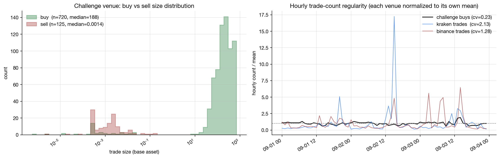
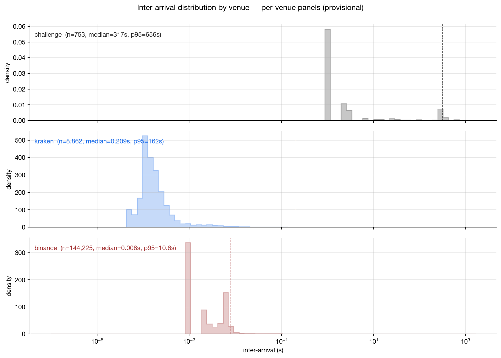

# ethbtc-manipulation-detection

Detection toolkit for suspicious trading patterns in ETH/BTC CEX trade and orderbook data. Pulls cross-venue baselines from Kraken and Binance over the same UTC window so "anomalous" means anomalous against named legitimate venues rather than vibes.

## What it does

Given a trades CSV in the canonical `(timestamp, price, size, side)` schema and a Level-2 orderbook snapshot CSV, the analysis layer computes:

- **Kyle's λ** (price impact per unit of signed flow, 60s bins)
- **Round-trip rate** (volume fraction that pairs buy/sell within a window, greedy nearest-time matching)
- **Top-N size concentration** (volume share in the most-repeated sizes, the bot-fingerprint signal)
- **Buy/sell ratio** (volume-weighted, with a count-weighted comparison for size asymmetry)
- **Inter-arrival distribution** (cadence fingerprint, log-binned)
- **Volume z-score** and **burst score** (per-bin and per-trade anomaly scoring against rolling baselines)

Plus the microstructure helpers (spread, imbalance, depth profile) on the orderbook side.

Every detector is a pure function on the canonical schema, so swapping in another venue's trade dump is a one-line change.

## A sample finding

Across a 72-hour ETH/BTC window with a venue I was investigating versus Kraken and Binance for the same period:



Two stories in one chart. Left: the venue's buy and sell trade sizes are completely disjoint populations (5 orders of magnitude apart, buy median ~188, sell median ~0.0014). They are not opposite sides of the same trades. Right: hourly trade counts on the investigated venue are suspiciously flat (cv 0.23) compared to Kraken (2.13) and Binance (1.28) over the same period. Bot pacing, even though the per-trade sizes are mostly unique (89.6% distinct).

The inter-arrival distribution backs this up:



Median inter-arrival is 317 seconds on the venue under investigation, 0.21s on Kraken, 0.008s on Binance. Three orders of magnitude separation; the slow cadence is incompatible with organic flow at this asset's typical activity level.

The headline cross-venue table (from `scripts/cross_venue_metrics.py`):

| metric                  | investigated | kraken    | binance   |
| ----------------------- | ------------ | --------- | --------- |
| trades                  | 845          | 11,955    | 171,953   |
| total volume            | 168,299      | 14,266    | 84,222    |
| kyle λ (60s)            | -1.9e-9      | +6.3e-8   | +6.4e-8   |
| round-trip rate         | 2.4e-7       | 4.22%     | 4.14%     |
| top-10 size share       | 6.6%         | 8.5%      | 10.3%     |
| buy-share (volume)      | 0.999994     | 0.467     | 0.488     |

The collapsed λ, near-zero round-trip rate, and 99.9994% buy-volume share are the joint signature. No single metric alone is conclusive; the combination is.

## Setup

```bash
uv sync                                            # installs project + dev deps
uv run python scripts/pull_comparison_venues.py    # ~90s, results cached
uv run pytest -q
```

To run the analysis against your own data, drop a trades CSV at `data/eth-btc-trades.csv` (columns: `timestamp,price,size,side`) and an orderbook snapshot CSV at `data/eth-btc-orderbooks.csv` (columns: `timestamp,asks,bids` where `asks` and `bids` are Python-literal lists of `{'price': float, 'size': float}` dicts).

Then:

```bash
uv run python scripts/provisional_charts.py        # generates the figures shown above
uv run python scripts/cross_venue_metrics.py       # cross-venue metrics table
uv run python scripts/buy_side_fingerprint.py      # detailed side-asymmetry analysis
```

## Layout

- `src/challenge/sources/` is one adapter per data source. CSVs go through `csv_loader.py`; Kraken and Binance REST adapters live in `comparison_venues.py`. All emit the canonical `(ts, price, qty, side)` schema.
- `src/challenge/analysis/` is the detection layer. `manipulation.py` (Kyle's λ, round-trip rate, top-N size share, buy/sell ratio, inter-arrival), `anomaly.py` (volume z-score, burst score), `plot.py` (chart helpers).
- `src/challenge/io/cache.py` is a read-through parquet cache for the comparison-venue pulls (slow and rate-limited; cache once, iterate locally).
- `notebooks/00_code_walkthrough.py` is a paired Jupytext walkthrough through every function, with the source inlined via `inspect.getsource` so you can read the analysis end to end without flipping between files. Open the `.ipynb` for the rendered view.
- `scripts/` has the analysis entry points: comparison-venue pulls, provisional chart generation, the cross-venue table, and the side-asymmetry deep dive.
- `tests/` has fast unit tests on the detection primitives.

## Conventions

- All detection functions are pure and typed. Input is a DataFrame in the canonical schema, output is either a scalar metric or a per-bin Series.
- Source adapters are the only place I/O happens. Analysis never reads from disk.
- Comparison-venue pulls are cached as parquet under `cache/` (gitignored). zstd-compressed, reads about 50x faster than the equivalent CSV.
- Notebooks are narrative. Reusable code lives in `src/`.

## Status

Analysis layer, comparison-venue adapters, cross-venue metrics table, provisional charts, and the code walkthrough notebook are in. Next up: a formal investigation notebook with finalized chart styling and the report markdown.
